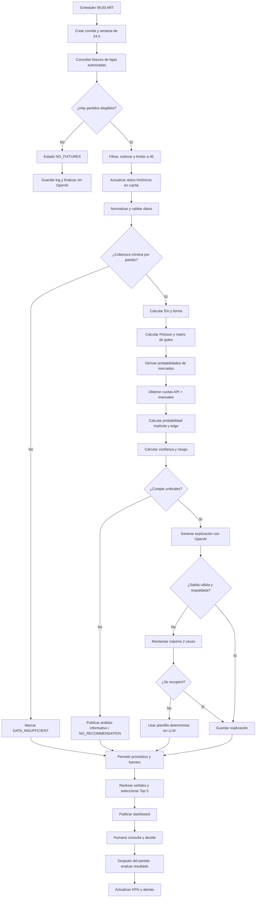
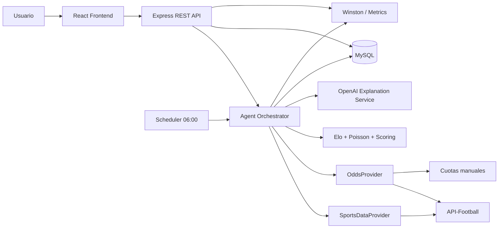

# Blueprint de Célula Híbrida — PronostIA

> **Proyecto final:** Gestión de AI Agents para Líderes y PMs  
> **Autor:** Bryan Márquez  
> **Versión:** 1.0  
> **Fecha del blueprint:** 27 de julio de 2026  
> **Fecha objetivo de entrega académica:** 30 de julio de 2026  
> **Estado:** Diseño aprobado para implementación por fases  
> **Tipo de solución:** Agente autónomo de análisis futbolístico prepartido con supervisión humana estratégica  
> **Repositorios previstos:** `pronostia-backend` y `pronostia-frontend`

---

## Resumen ejecutivo

**PronostIA** es una célula híbrida orientada a automatizar el análisis prepartido de encuentros de fútbol y convertir datos deportivos dispersos en pronósticos estadísticos explicables, trazables y comparables con cuotas de mercado.

El agente se ejecutará automáticamente todos los días a las **06:00, hora de Argentina**, consultará los partidos programados para las siguientes **24 horas** y analizará un máximo de **40 encuentros diarios** pertenecientes exclusivamente a las competiciones autorizadas. Si no existen partidos elegibles, la corrida finalizará sin invocar el modelo de lenguaje ni consumir presupuesto innecesariamente.

El sistema generará probabilidades para cuatro mercados iniciales:

1. Resultado del partido: **1X2**.
2. **Más/menos de 2,5 goles**.
3. **Ambos equipos marcan**.
4. **Doble oportunidad**, calculada como mercado derivado del 1X2.

Las probabilidades no serán calculadas por un LLM. El núcleo predictivo utilizará código determinista y auditable mediante una combinación inicial de **modelo Poisson**, **rating Elo**, forma reciente ponderada y rendimiento local/visitante. La API de OpenAI se utilizará únicamente para transformar resultados estructurados en explicaciones claras, identificar contradicciones y redactar un resumen ejecutivo; no podrá modificar los valores calculados por el motor estadístico.

PronostIA no realizará apuestas, no se conectará a cuentas de Bet365 o Betano, no gestionará bankroll y no garantizará beneficios. La decisión de utilizar o ignorar un pronóstico pertenecerá siempre al usuario. La aplicación incluirá controles de mayoría de edad, mensajes de juego responsable, trazabilidad de fuentes, límites de gasto y mecanismos para responder **“no existe un pronóstico recomendable”** cuando la evidencia sea insuficiente.

La solución se desarrollará en dos repositorios independientes:

- **Frontend:** React.js + Vite.
- **Backend:** JavaScript + Node.js + Express + MySQL.

**Codex** será el agente de código principal para construir ambos repositorios. El runtime productivo de PronostIA será un orquestador propio implementado como máquina de estados en Node.js. Claude Code y OpenClaw se analizan como alternativas, pero no forman parte obligatoria del MVP.

---

## Índice

1. [Definición estratégica del caso](#1-definición-estratégica-del-caso)
2. [Marco Persona–Tarea–Contexto](#2-marco-personatareacontexto)
3. [Alcance del MVP](#3-alcance-del-mvp)
4. [Mapa del proceso de negocio](#4-mapa-del-proceso-de-negocio)
5. [Diseño del Agentic Workflow](#5-diseño-del-agentic-workflow)
6. [Motor estadístico y lógica de pronóstico](#6-motor-estadístico-y-lógica-de-pronóstico)
7. [Selección y justificación tecnológica](#7-selección-y-justificación-tecnológica)
8. [Protocolos de supervisión y guardrails](#8-protocolos-de-supervisión-y-guardrails)
9. [Observabilidad, logging y auditoría](#9-observabilidad-logging-y-auditoría)
10. [KPIs operativos, predictivos y de calidad](#10-kpis-operativos-predictivos-y-de-calidad)
11. [Viabilidad económica y ROI operativo](#11-viabilidad-económica-y-roi-operativo)
12. [Roadmap de adopción](#12-roadmap-de-adopción)
13. [Especificación funcional para Codex](#13-especificación-funcional-para-codex)
14. [Evaluación, backtesting y mejora continua](#14-evaluación-backtesting-y-mejora-continua)
15. [Plan de comunicación y gestión del cambio](#15-plan-de-comunicación-y-gestión-del-cambio)
16. [Checklist de evaluación y criterios de éxito](#16-checklist-de-evaluación-y-criterios-de-éxito)
17. [Glosario](#17-glosario)
18. [Referencias](#18-referencias)
19. [Historial de versiones](#19-historial-de-versiones)

---

# 1. Definición estratégica del caso

## 1.1. Proceso de negocio elegido

El proceso seleccionado es el **análisis deportivo prepartido para generar pronósticos de fútbol basados en datos**.

Actualmente, una persona que desea analizar una jornada debe consultar varias fuentes por separado, revisar calendarios, resultados recientes, rendimiento local y visitante, goles anotados y recibidos, cuotas de distintas casas, tendencias y contexto competitivo. Después debe convertir esa información en una conclusión coherente y decidir si existe o no una oportunidad suficientemente sustentada.

El proceso manual habitual incluye:

1. Identificar los partidos relevantes de la jornada.
2. Confirmar fecha, horario y competición.
3. Consultar resultados históricos de ambos equipos.
4. Separar rendimiento general, local y visitante.
5. Calcular promedios ofensivos y defensivos.
6. Consultar cuotas disponibles.
7. Convertir cuotas en probabilidades implícitas.
8. Comparar estimación propia contra el mercado.
9. Redactar una conclusión.
10. Registrar el pronóstico para evaluarlo después del partido.

## 1.2. Problema o ineficiencia identificada

El proceso actual presenta cinco problemas principales:

- **Fragmentación de datos:** la información se encuentra distribuida entre múltiples sitios y formatos.
- **Consumo de tiempo:** analizar varios encuentros manualmente puede requerir horas por jornada.
- **Inconsistencia:** los criterios cambian según el momento, el cansancio o la fuente consultada.
- **Falta de trazabilidad:** no siempre queda registro de qué datos respaldaron una decisión.
- **Sesgo humano:** es fácil sobrevalorar equipos populares, resultados recientes o cuotas atractivas sin suficiente evidencia.

Además, un pronóstico puede parecer convincente aunque se base en datos incompletos o desactualizados. Por eso, el problema no consiste únicamente en “predecir quién gana”, sino en construir un proceso repetible, medible y auditable.

## 1.3. Objetivo de automatización

El objetivo es automatizar la recopilación, validación, normalización, cálculo y presentación de análisis prepartido para los encuentros de las siguientes 24 horas.

PronostIA deberá:

- Detectar automáticamente los partidos elegibles.
- Obtener datos deportivos desde proveedores autorizados.
- Mantener un histórico local para reducir solicitudes externas.
- Calcular probabilidades mediante modelos estadísticos reproducibles.
- Comparar las probabilidades con cuotas prepartido.
- Identificar posibles diferencias de valor.
- Generar una explicación clara y trazable.
- Destacar como máximo cinco pronósticos diarios.
- Guardar el resultado para su evaluación posterior.
- Abstenerse de recomendar cuando la evidencia sea insuficiente.

## 1.4. Objetivo de negocio

Aunque el proyecto nace para uso personal, portfolio y acceso a un grupo seleccionado, su valor de negocio se puede expresar en cuatro dimensiones:

| Dimensión | Valor esperado |
|---|---|
| **Eficiencia** | Reducir el tiempo dedicado a búsqueda y cálculo manual. |
| **Consistencia** | Aplicar las mismas reglas y umbrales en todos los partidos. |
| **Trazabilidad** | Registrar fuentes, datos, modelo, versión y resultado. |
| **Aprendizaje** | Medir qué competiciones y mercados funcionan mejor o peor. |

## 1.5. Por qué se utiliza una célula híbrida

PronostIA no debe operar como una automatización total porque el análisis deportivo contiene incertidumbre irreducible y la salida puede influir en decisiones económicas personales.

La automatización será adecuada para:

- Consultar APIs.
- Validar formatos.
- Calcular probabilidades.
- Aplicar reglas de scoring.
- Clasificar resultados.
- Generar explicaciones.
- Registrar métricas.

La intervención humana seguirá siendo necesaria para:

- Definir competiciones, mercados y umbrales.
- Cargar cuotas manuales cuando falten.
- Revisar errores, anomalías y datos contradictorios.
- Decidir si una recomendación será utilizada.
- Evaluar el rendimiento real del sistema.
- Autorizar cambios de modelo o aumento de autonomía.

El agente **informa y propone**; la persona **decide y gobierna**.

## 1.6. Principios de diseño

1. **API-first:** priorizar APIs autorizadas; no depender de scraping no permitido.
2. **Cálculo determinista:** el LLM no calcula probabilidades.
3. **Abstención válida:** no todos los partidos deben producir una recomendación.
4. **Trazabilidad completa:** todo dato factual debe conservar fuente y timestamp.
5. **Autonomía acotada:** el agente no puede apostar ni conectarse a cuentas de casas.
6. **Costo controlado:** OpenAI tendrá un presupuesto máximo de USD 20 mensuales.
7. **Progresividad:** la ampliación de ligas, mercados o autonomía depende de KPIs.
8. **Juego responsable:** no utilizar lenguaje de certeza ni promover recuperación de pérdidas.

---

# 2. Marco Persona–Tarea–Contexto

## 2.1. Persona: Job Description del agente digital

| Atributo | Definición |
|---|---|
| **Nombre** | PronostIA |
| **Rol** | Analista autónomo prepartido de fútbol que transforma datos deportivos en probabilidades, señales y explicaciones auditables. |
| **Perfil** | Técnico, prudente, directo, educativo y no promocional. |
| **Objetivo** | Procesar los partidos elegibles de las próximas 24 horas y generar análisis estructurados sin ejecutar apuestas. |
| **Nivel de autonomía** | Nivel 4 de 5 para recopilación, cálculo, explicación y monitoreo; nivel 0 para ejecución de apuestas. |
| **Frecuencia** | Una corrida automática diaria a las 06:00 en `America/Argentina/Buenos_Aires`, más ejecución manual autorizada. |
| **Volumen máximo** | 40 partidos por corrida diaria. |
| **Capacidades** | Consultar APIs, leer caché y base de datos, normalizar datos, calcular Elo y Poisson, evaluar mercados, consultar cuotas, invocar OpenAI para explicar, persistir resultados y generar métricas. |
| **Herramientas autorizadas** | API deportiva configurada, API de OpenAI, MySQL, servicios internos del backend y carga manual de cuotas. |
| **Acciones prohibidas** | Apostar, iniciar sesión en Bet365/Betano, gestionar dinero, garantizar beneficios, inventar estadísticas, ocultar incertidumbre o alterar cálculos estadísticos desde el LLM. |
| **Salida principal** | Pronóstico estructurado por partido y mercado, confianza, riesgo, evidencia, fuentes, advertencias y explicación. |
| **Escalamiento** | Datos insuficientes, fuentes contradictorias, presupuesto agotado, fallos repetidos, valores anómalos o degradación de KPIs. |

## 2.2. Tarea

### Actividad principal

Procesar automáticamente la jornada de fútbol de las próximas 24 horas y presentar análisis prepartido para los mercados autorizados.

### Subtareas

1. Iniciar la corrida programada.
2. Calcular la ventana temporal exacta de 24 horas.
3. Consultar fixtures de competiciones autorizadas.
4. Filtrar partidos cancelados, finalizados o no elegibles.
5. Limitar la corrida a 40 encuentros.
6. Consultar o actualizar históricos de equipos y ligas.
7. Normalizar identificadores, fechas, equipos y competiciones.
8. Validar cobertura mínima de datos.
9. Calcular ratings Elo.
10. Calcular tasas esperadas de gol mediante Poisson.
11. Construir matriz de resultados probables.
12. Derivar probabilidades 1X2, over/under 2,5, BTTS y doble oportunidad.
13. Obtener cuotas disponibles.
14. Permitir carga manual de cuotas de Betano.
15. Calcular probabilidad implícita y margen estimado.
16. Calcular confianza y riesgo.
17. Aplicar reglas de abstención.
18. Invocar OpenAI para explicar los resultados válidos.
19. Guardar pronósticos, fuentes, costos y logs.
20. Ordenar las señales y destacar las cinco mejores.
21. Evaluar los resultados cuando finalicen los partidos.
22. Actualizar dashboard y KPIs.

### Nivel de complejidad

**Alto.** El flujo combina programación temporal, múltiples APIs, persistencia, cálculos estadísticos, control de presupuesto, explicaciones con LLM, evaluación posterior y supervisión humana por excepción.

No se considera un simple chatbot porque mantiene estado, ejecuta herramientas, itera, evalúa resultados intermedios y toma decisiones de continuidad.

## 2.3. Contexto operativo

### Usuarios

- Bryan como propietario y administrador.
- Reclutadores o evaluadores del portfolio con acceso de lectura.
- Grupo seleccionado de usuarios invitados en fases posteriores.

### Sistemas involucrados

| Sistema | Función |
|---|---|
| **Frontend React** | Presentar jornadas, análisis, históricos y KPIs. |
| **Backend Node.js/Express** | Ejecutar el workflow, exponer API REST y aplicar reglas. |
| **MySQL** | Persistir fixtures, históricos, cuotas, pronósticos, logs y métricas. |
| **Scheduler** | Activar la corrida a las 06:00. |
| **API deportiva** | Fixtures, resultados, históricos y cuotas disponibles. |
| **API de OpenAI** | Generar explicación y resumen a partir de datos verificados. |
| **Proveedor manual de cuotas** | Registrar cuotas de Betano u otras fuentes no disponibles por API. |
| **Codex** | Construir y mantener los repositorios durante el desarrollo. |

### Restricciones

- Presupuesto máximo inicial de **USD 20 mensuales para OpenAI**.
- API deportiva en plan gratuito durante el MVP.
- Máximo de 40 partidos diarios.
- Solo análisis prepartido.
- Sin lesiones, suspensiones ni alineaciones probables en el MVP.
- Sin mercados en vivo.
- Sin scraping como dependencia principal.
- Sin integración transaccional con casas de apuestas.
- Datos de cuotas sujetos a disponibilidad por proveedor y región.
- Cobertura de temporadas y competiciones dependiente del plan de la API.

### Competiciones autorizadas

| Región | Competición |
|---|---|
| España | LaLiga |
| Francia | Ligue 1 |
| Inglaterra | Premier League |
| Italia | Serie A |
| Alemania | Bundesliga |
| Argentina | Liga Profesional Argentina |
| Brasil | Brasileirão Série A |
| UEFA | Champions League |
| UEFA | Europa League |
| CONMEBOL | Copa Libertadores |
| CONMEBOL | Copa Sudamericana |

Los identificadores concretos de las competiciones deben resolverse y almacenarse desde el proveedor. No deben quedar hardcodeados sin validación de temporada.

### Riesgos asociados

- Datos faltantes o retrasados.
- Cobertura desigual entre ligas.
- Cuotas ausentes o desactualizadas.
- Sobreajuste del modelo.
- Falsa sensación de precisión.
- Dependencia de un proveedor externo.
- Costos de tokens no controlados.
- Filtración de claves de API.
- Interpretaciones del LLM no respaldadas.
- Confusión entre tasa de acierto y rentabilidad.
- Uso irresponsable de la información.

---

# 3. Alcance del MVP

## 3.1. Incluido

- Ejecución automática diaria.
- Ventana de 24 horas.
- Máximo de 40 partidos.
- Once competiciones autorizadas.
- 1X2.
- Over/under 2,5.
- Ambos equipos marcan.
- Doble oportunidad derivada.
- Elo + Poisson + forma ponderada + localía.
- Cuotas prepartido cuando estén disponibles.
- Bet365 como bookmaker preferente cuando el proveedor la incluya.
- Betano mediante API si está disponible o carga manual.
- Top 5 diario.
- Historial de pronósticos.
- Evaluación posterior.
- Dashboard de KPIs.
- Explicaciones mediante OpenAI.
- Juego responsable.
- Acceso personal y demostración de portfolio.

## 3.2. Excluido del MVP

- Apuestas automáticas.
- Inicio de sesión en casas de apuestas.
- Gestión de bankroll o stake.
- Combinadas automáticas.
- Pronósticos en vivo.
- Lesiones.
- Suspensiones.
- Alineaciones probables o confirmadas.
- Mercados de jugadores.
- Tarjetas, córners y tiros.
- Machine learning supervisado entrenado desde cero.
- Notificaciones push complejas.
- Suscripciones o monetización.
- Scraping de páginas protegidas.

## 3.3. Criterio de priorización

El MVP prioriza mercados que pueden derivarse de una distribución de goles y de la fuerza relativa de equipos. Esto reduce dependencias, facilita el backtesting y permite explicar el modelo.

---

# 4. Mapa del proceso de negocio

## 4.1. Proceso manual actual

```text
Identificar partidos
→ abrir varias páginas
→ copiar resultados recientes
→ separar local/visitante
→ calcular promedios
→ revisar cuotas
→ interpretar información
→ redactar conclusión
→ decidir si usarla
→ registrar resultado manualmente
```

## 4.2. Proceso objetivo híbrido

```text
Scheduler diario
→ detectar fixtures autorizados
→ recuperar datos y caché
→ validar cobertura
→ calcular probabilidades
→ consultar cuotas
→ evaluar edge, confianza y riesgo
→ generar explicación
→ publicar dashboard
→ humano decide si utiliza la información
→ sistema evalúa resultado y actualiza KPIs
```

## 4.3. Asignación automático/humano

| Paso | Naturaleza | Responsable |
|---|---|---|
| Definir ligas y mercados | Humana | Product Owner |
| Activar corrida diaria | Automática | Scheduler |
| Consultar fixtures | Automática | Agente |
| Validar datos | Automática | Agente + reglas |
| Resolver datos contradictorios | Híbrida | Agente detecta, humano revisa |
| Calcular probabilidades | Automática | Motor estadístico |
| Generar explicación | Automática | OpenAI bajo restricciones |
| Cargar cuota Betano faltante | Humana | Administrador |
| Publicar análisis | Automática | Backend |
| Realizar una apuesta | Humana y externa al sistema | Usuario |
| Evaluar desempeño | Automática + revisión periódica | Agente + Product Owner |
| Cambiar modelo/umbrales | Humana | Product Owner/Desarrollador |

---

# 5. Diseño del Agentic Workflow

## 5.1. Arquitectura conceptual



## 5.2. Diagrama ASCII de respaldo

```text
┌──────────────────────────────────────────────┐
│ 06:00 ART — INICIO PROGRAMADO               │
└──────────────────────┬───────────────────────┘
                       ▼
┌──────────────────────────────────────────────┐
│ Crear RUN + ventana [ahora, ahora + 24 h]    │
└──────────────────────┬───────────────────────┘
                       ▼
┌──────────────────────────────────────────────┐
│ Consultar fixtures de competiciones válidas │
└──────────────────────┬───────────────────────┘
                       ▼
                ¿Hay partidos?
                 ┌─────┴─────┐
                No           Sí
                ▼             ▼
        NO_FIXTURES      Limitar a 40
                │             │
                │             ▼
                │     Actualizar caché histórica
                │             │
                │             ▼
                │     Validar cobertura y frescura
                │        ┌────┴────┐
                │       Baja       Suficiente
                │        ▼             ▼
                │  DATA_INSUFFICIENT   Elo + Poisson
                │                      │
                │                      ▼
                │              Probabilidades de mercado
                │                      │
                │                      ▼
                │              Cuotas API/manuales
                │                      │
                │                      ▼
                │           Edge + confianza + riesgo
                │                 ┌────┴────┐
                │             No cumple   Cumple
                │                 ▼          ▼
                │          Sin recomendación OpenAI explica
                │                 │          │
                └─────────────────┴──────────┘
                                  ▼
                          Persistir + rankear
                                  ▼
                           Top 5 + dashboard
                                  ▼
                       Decisión humana externa
                                  ▼
                       Evaluación postpartido
```

## 5.3. Estados del proceso

```text
SCHEDULED
→ RUN_CREATED
→ FETCHING_FIXTURES
→ NO_FIXTURES | FIXTURES_READY
→ REFRESHING_CACHE
→ VALIDATING_DATA
→ DATA_INSUFFICIENT | DATA_READY
→ CALCULATING_ELO
→ CALCULATING_POISSON
→ PROBABILITIES_READY
→ FETCHING_ODDS
→ SCORING
→ NO_RECOMMENDATION | EXPLANATION_PENDING
→ EXPLANATION_READY | EXPLANATION_FALLBACK
→ PERSISTED
→ PUBLISHED
→ WAITING_RESULT
→ EVALUATED
→ COMPLETED
```

Estados excepcionales:

```text
PARTIAL_SUCCESS
BUDGET_BLOCKED
RATE_LIMITED
PROVIDER_UNAVAILABLE
VALIDATION_FAILED
HUMAN_REVIEW_REQUIRED
FAILED
```

## 5.4. Transiciones y validaciones

| Origen | Destino | Condición |
|---|---|---|
| `FETCHING_FIXTURES` | `NO_FIXTURES` | Cero fixtures válidos. |
| `FETCHING_FIXTURES` | `FIXTURES_READY` | Al menos un fixture válido. |
| `VALIDATING_DATA` | `DATA_READY` | Cumple cobertura mínima. |
| `VALIDATING_DATA` | `DATA_INSUFFICIENT` | No alcanza muestra o frescura requerida. |
| `SCORING` | `NO_RECOMMENDATION` | Confianza < 70, edge < 5 pp o riesgo alto. |
| `SCORING` | `EXPLANATION_PENDING` | Confianza ≥ 70, edge ≥ 5 pp y riesgo aceptable. |
| `EXPLANATION_PENDING` | `EXPLANATION_READY` | JSON válido y sin afirmaciones no respaldadas. |
| `EXPLANATION_PENDING` | `EXPLANATION_FALLBACK` | OpenAI falla o presupuesto bloqueado. |
| `PUBLISHED` | `WAITING_RESULT` | Partido aún no finalizado. |
| `WAITING_RESULT` | `EVALUATED` | Resultado oficial disponible. |

## 5.5. Iteración y replanificación

### Reintentos de API

- Máximo: **3 intentos**.
- Estrategia: backoff exponencial con jitter.
- Ejemplo: 2 s, 8 s, 30 s.
- No reintentar errores 4xx causados por parámetros inválidos, excepto `429`.
- Registrar cada intento.

### Reintentos del LLM

- Máximo: **2 intentos**.
- Primer fallo: reenviar con error de validación y esquema esperado.
- Segundo fallo: activar explicación determinista basada en plantilla.
- Nunca bloquear el cálculo estadístico por un fallo del LLM.

### Replanificación por cuota de API

Si la cuota diaria está cerca del límite:

1. Priorizar fixtures y resultados.
2. Utilizar históricos locales.
3. Omitir llamadas opcionales.
4. Reducir actualización de odds.
5. No usar endpoints de predicción del proveedor como fuente primaria.
6. Marcar cobertura parcial en la salida.

## 5.6. Condiciones de corte

### Éxito completo

- Fixtures procesados.
- Datos validados.
- Probabilidades calculadas.
- Pronósticos persistidos.
- Dashboard publicado.
- Logs cerrados.

### Éxito parcial

- Al menos un partido procesado correctamente.
- Fallos aislados no afectan al resto.
- Se informa qué partidos quedaron incompletos.

### Corte controlado

- No hay partidos.
- Se agotó la cuota del proveedor.
- Se alcanzó el presupuesto mensual de OpenAI.
- Faltan credenciales.
- Tres fallos consecutivos del proveedor.
- Esquema de datos incompatible.
- Más del 50 % de los partidos presenta datos insuficientes.

## 5.7. Human-in-the-loop

PronostIA utiliza supervisión humana estratégica, no aprobación manual de cada pronóstico.

| Punto | Intervención humana | Motivo |
|---|---|---|
| Configuración inicial | Define ligas, mercados y límites. | Gobernanza. |
| Carga de Betano | Agrega cuota manual. | Falta de API garantizada. |
| Excepciones | Revisa conflictos o fallos repetidos. | Evitar propagación. |
| Cambios de modelo | Aprueba pesos y versiones. | Control de calidad. |
| Revisión semanal | Analiza KPIs y muestras. | Detectar degradación. |
| Uso del pronóstico | Decide ignorar o considerar. | Responsabilidad humana. |

## 5.8. Registro de decisión auditable

No se almacenará una cadena de pensamiento privada extensa. Cada paso generará un resumen verificable:

```json
{
  "runId": "run_2026-07-27_0600",
  "fixtureId": "provider-fixture-id",
  "stage": "SCORING",
  "inputsUsed": ["elo", "poisson", "recent_form", "home_away_split", "odds"],
  "rulesApplied": ["MIN_CONFIDENCE_70", "MIN_EDGE_5PP"],
  "dataCoverage": 0.92,
  "decision": "RECOMMENDABLE",
  "decisionSummary": "La selección supera los umbrales de edge y confianza con cobertura suficiente.",
  "warnings": [],
  "timestamp": "2026-07-27T09:12:00Z"
}
```

---

# 6. Motor estadístico y lógica de pronóstico

## 6.1. Separación de responsabilidades

| Componente | Responsabilidad |
|---|---|
| Motor estadístico | Calcular probabilidades. |
| Motor de reglas | Aplicar umbrales y clasificar riesgo. |
| LLM | Explicar datos ya calculados. |
| Humano | Gobernar y decidir uso final. |

## 6.2. Datos mínimos por partido

- Identificador de fixture.
- Competición y temporada.
- Fecha y zona horaria.
- Equipo local y visitante.
- Últimos 10 partidos disponibles por equipo.
- Últimos 5 como local para el local.
- Últimos 5 como visitante para el visitante.
- Goles a favor y en contra.
- Rating Elo actual.
- Promedio de goles de la competición.
- Cuotas disponibles y timestamp.

No se incluirán lesiones, sanciones ni alineaciones en el MVP.

## 6.3. Forma reciente ponderada

Los partidos más recientes tendrán mayor peso. Configuración inicial:

```text
Partido más reciente: peso 1,00
Segundo:             peso 0,90
Tercero:             peso 0,81
...
Décimo:              peso 0,39
```

La constante de decaimiento será configurable y deberá calibrarse mediante backtesting.

## 6.4. Rating Elo

Configuración inicial:

- Rating inicial: 1500.
- Factor K inicial: 20.
- Ventaja local inicial: 60 puntos Elo.
- Ajuste por margen de victoria: configurable.

Probabilidad esperada del local:

```text
E_home = 1 / (1 + 10 ^ (-(R_home + H - R_away) / 400))
```

Actualización:

```text
R_new = R_old + K × (resultado_real - resultado_esperado)
```

El rating no se presentará como verdad absoluta; será una señal dentro del modelo híbrido.

## 6.5. Modelo Poisson

Se calcularán goles esperados para local y visitante:

```text
lambda_home = league_home_avg
              × home_attack_strength
              × away_defence_weakness
              × elo_home_factor
              × recent_form_factor

lambda_away = league_away_avg
              × away_attack_strength
              × home_defence_weakness
              × elo_away_factor
              × recent_form_factor
```

Probabilidad de marcar `k` goles:

```text
P(X = k) = (e^-lambda × lambda^k) / k!
```

Se generará una matriz de 0 a 8 goles por equipo. La masa de probabilidad restante deberá ser menor a 0,1 % o agregarse al último intervalo.

## 6.6. Probabilidades derivadas

### 1X2

```text
P(1) = suma de celdas donde goles_local > goles_visitante
P(X) = suma de celdas donde goles_local = goles_visitante
P(2) = suma de celdas donde goles_local < goles_visitante
```

### Over/under 2,5

```text
P(Over 2.5) = suma donde goles_local + goles_visitante >= 3
P(Under 2.5) = 1 - P(Over 2.5)
```

### Ambos equipos marcan

```text
P(BTTS Sí) = suma donde goles_local >= 1 y goles_visitante >= 1
P(BTTS No) = 1 - P(BTTS Sí)
```

### Doble oportunidad

```text
P(1X) = P(1) + P(X)
P(X2) = P(X) + P(2)
P(12) = P(1) + P(2)
```

## 6.7. Cuotas y probabilidad implícita

Para cuota decimal:

```text
probabilidad_implicita = 1 / cuota
```

Ejemplo:

```text
Cuota 1,85 → 1 / 1,85 = 0,5405 = 54,05 %
```

### Eliminación básica del margen

Cuando estén disponibles todas las selecciones de un mercado, se normalizará el overround:

```text
p_justa_i = p_implicita_i / suma(p_implicitas_del_mercado)
```

## 6.8. Edge estimado

```text
edge_pp = (probabilidad_modelo - probabilidad_mercado_ajustada) × 100
```

Umbral inicial:

```text
edge mínimo = 5 puntos porcentuales
```

Este umbral no implica rentabilidad. Debe validarse con una muestra suficiente.

## 6.9. Confianza

La confianza inicial se calculará con una puntuación de 0 a 100:

| Factor | Peso máximo |
|---|---:|
| Completitud de datos | 30 |
| Tamaño y calidad de muestra | 20 |
| Coherencia Elo/Poisson/forma | 25 |
| Magnitud del edge | 15 |
| Frescura de datos y cuotas | 10 |
| **Total** | **100** |

### Clasificación

- 0–49: baja.
- 50–69: media, solo informativa.
- 70–84: alta y elegible para destacar.
- 85–100: muy alta, sin equivaler a certeza.

## 6.10. Riesgo

| Riesgo | Condición orientativa |
|---|---|
| Bajo | Datos completos, cuota fresca, modelos coherentes. |
| Medio | Cobertura parcial o discrepancia moderada. |
| Alto | Datos escasos, cuota antigua, modelos contradictorios o edge extremo no sustentado. |

## 6.11. Regla de recomendación

Una selección podrá aparecer como recomendación solo si:

```text
confianza >= 70
AND edge >= 5 pp
AND riesgo != alto
AND datos completos >= 80 %
AND cuota actualizada dentro de la ventana permitida
AND no existen errores críticos
```

De lo contrario:

```text
recommendation = "NO_RECOMMENDATION"
```

## 6.12. Ranking diario

El ranking del Top 5 utilizará:

```text
rankingScore = confianza × 0,55
             + edgeNormalizado × 0,25
             + dataCoverage × 100 × 0,20
```

Restricciones:

- Máximo una selección destacada por partido en el Top 5.
- No generar combinadas.
- No seleccionar mercados duplicados si una misma señal proviene de la misma matriz sin valor adicional.

## 6.13. Contrato de salida del pronóstico

```json
{
  "fixtureId": "123456",
  "match": "Equipo local vs Equipo visitante",
  "competition": "LaLiga",
  "kickoff": "2026-07-28T19:00:00Z",
  "market": "OVER_UNDER_2_5",
  "selection": "OVER_2_5",
  "modelProbability": 0.62,
  "marketProbability": 0.55,
  "odds": 1.82,
  "bookmaker": "Bet365",
  "oddsSource": "API",
  "oddsUpdatedAt": "2026-07-27T09:00:00Z",
  "edgePercentagePoints": 7.0,
  "confidenceScore": 76,
  "riskLevel": "MEDIUM",
  "recommendation": "CONSIDER",
  "modelVersion": "hybrid-v1.0.0",
  "explanation": {
    "summary": "El modelo estima una probabilidad superior a la implícita del mercado.",
    "supportingFactors": [],
    "counterFactors": [],
    "warnings": []
  },
  "sources": [],
  "generatedAt": "2026-07-27T09:15:00Z"
}
```

---

# 7. Selección y justificación tecnológica

## 7.1. Stack oficial

| Capa | Tecnología | Justificación |
|---|---|---|
| Frontend | React.js + Vite | Stack conocido, rápido para SPA y portfolio. |
| UI | Material UI + CSS Modules | Componentes accesibles y control visual. |
| Backend | JavaScript + Node.js + Express | Coherencia con experiencia previa y ecosistema de APIs. |
| Base de datos | MySQL | Modelo relacional adecuado para fixtures, cuotas y métricas. |
| Scheduler | `node-cron` inicialmente | Permite ejecución diaria con zona horaria. |
| Logs | Winston | Logs estructurados y niveles configurables. |
| Validación | Zod o Joi | Contratos de entrada y salida. |
| HTTP | Axios o `fetch` nativo | Integración con APIs. |
| Tests | Jest + Supertest | Pruebas unitarias e integración. |
| IA explicativa | API de OpenAI | Generación de explicaciones controladas. |
| Desarrollo asistido | Codex | Herramienta principal de implementación. |
| Deploy frontend | Vercel | Adecuado para React/Vite. |
| Deploy backend | Railway | Backend Node.js y MySQL gestionados. |

## 7.2. Proveedor deportivo

### Selección inicial

**API-Football** se utilizará como candidato principal del MVP por ofrecer fixtures, estadísticas, cuotas y bookmakers mediante API.

A la fecha de elaboración de este documento, su página oficial informa:

- Plan gratuito de USD 0.
- 100 solicitudes por día.
- Acceso a endpoints, con limitaciones de temporadas en el plan gratuito.
- Plan Pro de USD 19 mensuales y 7.500 solicitudes por día.

La cobertura concreta debe validarse por competición y temporada antes de activar cada liga.

### Estrategia de abstracción

```text
SportsDataProvider
├── ApiFootballProvider
├── ManualSportsDataProvider (solo soporte administrativo)
└── FutureProviderAdapter

OddsProvider
├── ApiFootballOddsProvider
├── ManualOddsProvider
└── FutureOddsProvider
```

La lógica de negocio no deberá depender directamente de la forma del JSON de un proveedor.

## 7.3. Presupuesto de llamadas deportivas

El plan gratuito impone un máximo de 100 solicitudes diarias. Para mantener el MVP viable:

- Cachear referencias de ligas, bookmakers y mercados.
- Importar históricos por competición y temporada en procesos controlados.
- Derivar estadísticas desde fixtures almacenados localmente.
- Consultar fixtures diarios por competición.
- Consultar odds por fecha/competición y manejar paginación.
- Evitar consultas por jugador, lesiones o alineaciones.
- No llamar al endpoint de predicciones como sustituto del modelo propio.
- Detener llamadas opcionales al alcanzar el 80 % de la cuota.

## 7.4. OpenAI

### Rol

OpenAI se utilizará para:

- Explicar resultados calculados.
- Resumir factores favorables y contrarios.
- Detectar incoherencias textuales.
- Generar una salida estructurada bajo esquema.

OpenAI no podrá:

- Recalcular probabilidades.
- Cambiar el edge.
- Inventar datos.
- Crear una recomendación que el motor de reglas haya rechazado.

### Presupuesto

- Presupuesto mensual: **USD 20**.
- Alerta al 70 %.
- Modo degradado al 85 %.
- Bloqueo de nuevas llamadas al 100 %.
- En modo degradado se utiliza explicación determinista.
- Modelo configurable mediante `OPENAI_MODEL`; no debe fijarse permanentemente a un nombre sin revisión de costo y disponibilidad.

## 7.5. Comparación Claude Code, Codex y OpenClaw

| Herramienta | Fortalezas | Limitaciones para PronostIA | Decisión |
|---|---|---|---|
| **Codex** | Desarrollo multiarchivo, generación y edición de código, tests, ejecución de tareas y revisión de repositorios. | Requiere instrucciones y revisión humana. No es el runtime productivo. | **Seleccionado como herramienta principal de desarrollo.** |
| **Claude Code** | Adecuado para análisis de repositorios y cambios amplios. | Duplicaría la función de Codex y añadiría otra herramienta al flujo. | Alternativa de apoyo, no obligatoria. |
| **OpenClaw** | Automatización de navegación e interacción con interfaces web. | El MVP será API-first; usar navegación para casas de apuestas aumenta fragilidad y riesgos de términos de servicio. | No seleccionado para el MVP. Reevaluar solo para tareas administrativas autorizadas. |

## 7.6. Por qué el runtime será propio

El backend implementará una máquina de estados porque permite:

- Controlar cada transición.
- Reintentar de forma segura.
- Persistir estado.
- Continuar después de un fallo.
- Aplicar límites de costo.
- Mantener trazabilidad.
- Ejecutar sin depender de un framework agéntico externo.

## 7.7. Arquitectura técnica



---

# 8. Protocolos de supervisión y guardrails

## 8.1. Guardrails de producto

1. No realizar apuestas.
2. No conectarse a Bet365 o Betano.
3. No aceptar credenciales de casas de apuestas.
4. No garantizar resultados.
5. No utilizar “apuesta segura”.
6. No generar combinadas en el MVP.
7. No sugerir recuperación de pérdidas.
8. No sugerir aumento de monto por rachas.
9. No utilizar pronósticos como asesoramiento financiero.
10. Mostrar juego responsable y mayoría de edad.

## 8.2. Guardrails de datos

- Cada dato debe tener fuente y timestamp.
- No mezclar temporadas sin normalización.
- No procesar partidos con identificadores ambiguos.
- No utilizar cuotas con antigüedad superior al límite configurado.
- No inferir lesiones o alineaciones.
- No completar campos faltantes con el LLM.
- Rechazar probabilidades fuera de `[0,1]`.
- Verificar que las probabilidades 1X2 sumen aproximadamente 1.
- Verificar que las probabilidades complementarias sumen 1.

## 8.3. Guardrails del LLM

Prompt de sistema resumido:

```text
Eres el módulo explicativo de PronostIA.
Usa exclusivamente el JSON suministrado.
No modifiques probabilidades, cuotas, edge, confianza ni recomendación.
No inventes lesiones, alineaciones, estadísticas o noticias.
Distingue factores favorables y factores de riesgo.
No uses expresiones de certeza o garantía.
Si los datos no permiten una explicación sustentada, devuelve DATA_INSUFFICIENT.
Responde con JSON válido conforme al esquema.
No expongas razonamiento privado; entrega un resumen de decisión auditable.
```

## 8.4. Guardrails de costo

| Umbral | Acción |
|---|---|
| 70 % de USD 20 | Alertar al administrador. |
| 85 % | Generar LLM solo para Top 5; resto usa plantilla. |
| 100 % | Bloquear OpenAI hasta el siguiente período. |

## 8.5. Gestión de errores

### Circuit breaker

Se abrirá cuando:

- Existan cinco fallos del mismo proveedor en diez minutos.
- El porcentaje de error supere 50 % en una corrida.
- El proveedor responda con esquema incompatible.

Estados:

```text
CLOSED → OPEN → HALF_OPEN → CLOSED
```

### Idempotencia

- Cada corrida tendrá una clave única por fecha y ventana.
- Cada pronóstico tendrá restricción única por fixture, mercado, selección y versión.
- Reintentos no deben duplicar registros.

## 8.6. Protocolo de escalamiento

| Disparador | Severidad | Acción |
|---|---|---|
| Sin partidos | Informativa | Finalizar normalmente. |
| Un partido sin datos | Baja | Marcar y continuar. |
| Más del 50 % sin datos | Alta | Detener análisis y alertar. |
| Cuota agotada | Alta | Usar caché, cortar opcionales y notificar. |
| Presupuesto OpenAI agotado | Media | Activar fallback determinista. |
| Probabilidades inválidas | Crítica | Bloquear publicación del partido. |
| Cambio inesperado de esquema | Crítica | Abrir circuit breaker. |
| Posible dato inventado por LLM | Crítica | Descartar explicación y registrar incidente. |

## 8.7. Matriz de riesgos

| Riesgo | Probabilidad | Impacto | Control |
|---|---|---|---|
| API sin cobertura | Media | Alta | Validación temprana y adaptadores. |
| Exceso de cuota | Alta en free tier | Alta | Caché y presupuesto diario. |
| Datos desactualizados | Media | Alta | Timestamp y TTL. |
| Alucinación del LLM | Media | Alta | JSON cerrado, RAG/datos suministrados, validación. |
| Sobreajuste | Media | Alta | Backtesting temporal y baseline. |
| Falsa confianza | Media | Alta | Confianza ≠ certeza y argumentos en contra. |
| Exposición de API keys | Baja | Crítica | Variables de entorno y secret manager. |
| Uso compulsivo | Baja/Media | Alta | Juego responsable y sin stakes. |
| Rentabilidad aparente por muestra pequeña | Alta | Alta | Mínimo de muestra y intervalos de confianza. |

## 8.8. Juego responsable

La interfaz deberá mostrar:

- “PronostIA ofrece análisis estadístico, no garantías de beneficio”.
- “Solo para mayores de edad según la legislación aplicable”.
- “No apuestes dinero que no puedas permitirte perder”.
- “Una tasa de acierto positiva no garantiza rentabilidad”.
- Enlace a recursos de juego responsable.

No se almacenarán montos apostados en el MVP.

---

# 9. Observabilidad, logging y auditoría

## 9.1. Logs por corrida

- `runId`.
- Inicio y fin.
- Zona horaria.
- Ventana analizada.
- Fixtures encontrados.
- Fixtures procesados.
- Llamadas por proveedor.
- Cuota API restante.
- Tokens de entrada y salida.
- Costo estimado OpenAI.
- Reintentos.
- Errores.
- Estado final.

## 9.2. Logs por partido

- Fixture y competición.
- Datos usados.
- Cobertura.
- Versión del modelo.
- Lambdas de Poisson.
- Elo de equipos.
- Probabilidades.
- Cuotas.
- Edge.
- Confianza.
- Riesgo.
- Recomendación.
- Fuente de explicación.
- Resultado posterior.

## 9.3. Niveles de log

| Nivel | Uso |
|---|---|
| `debug` | Cálculos internos en desarrollo. |
| `info` | Transiciones y resultados normales. |
| `warn` | Datos parciales, fallback, límite cercano. |
| `error` | Fallos recuperables o partido bloqueado. |
| `fatal` | Corrida detenida o integridad comprometida. |

## 9.4. Métricas técnicas

- Latencia por etapa.
- Llamadas por endpoint.
- Cache hit ratio.
- Error rate.
- Reintentos.
- Uso de tokens.
- Costo por explicación.
- Cantidad de fallbacks.
- Disponibilidad del scheduler.

## 9.5. Retención

- Logs operativos: 90 días.
- Pronósticos y resultados: retención indefinida mientras el proyecto esté activo.
- Datos crudos de proveedor: según términos del proveedor.
- Claves: nunca en logs.

---

# 10. KPIs operativos, predictivos y de calidad

## 10.1. KPIs operativos mínimos

| KPI | Fórmula | Objetivo MVP | Alerta |
|---|---|---:|---:|
| Latencia por corrida | fin - inicio | ≤ 20 min para 40 partidos | > 30 min |
| Tasa de éxito de corridas | corridas completas / corridas totales | ≥ 90 % | < 85 % |
| Costo OpenAI por partido | costo IA / partidos explicados | ≤ USD 0,05 | > USD 0,08 |
| Costo mensual OpenAI | suma mensual | ≤ USD 20 | > USD 14 al 70 % del mes |
| Tasa de datos válidos | partidos con cobertura / elegibles | ≥ 85 % | < 75 % |
| Error rate de proveedor | llamadas fallidas / llamadas | < 5 % | > 10 % |
| Cache hit ratio | lecturas de caché / solicitudes de datos | ≥ 70 % | < 50 % |
| Ratio de fallback LLM | explicaciones fallback / total | < 10 % | > 20 % |
| Intervención humana por excepción | incidencias humanas / corridas | ≤ 20 % | > 30 % |

## 10.2. KPIs predictivos

| KPI | Definición | Uso |
|---|---|---|
| Brier Score | Error cuadrático de probabilidades. Menor es mejor. | Calibración. |
| Log Loss | Penaliza probabilidades incorrectas muy seguras. | Calidad probabilística. |
| Accuracy 1X2 | Selecciones correctas / total. | Métrica descriptiva. |
| Precisión por mercado | Aciertos por mercado. | Comparación. |
| ROI simulado | Retorno hipotético / monto hipotético. | Evaluación, no promesa. |
| Yield simulado | Beneficio hipotético / volumen hipotético. | Comparación. |
| Closing Line Value | Comparación de cuota tomada vs cierre. | Calidad de detección de valor. |
| Calibration Error | Diferencia entre probabilidad predicha y frecuencia real. | Confianza del modelo. |
| Max Drawdown simulado | Mayor caída acumulada en simulación. | Riesgo. |

## 10.3. KPIs de calidad explicativa

- Porcentaje de explicaciones con fuentes: objetivo 100 %.
- Afirmaciones no respaldadas: objetivo 0 %.
- JSON válido: ≥ 99 % tras reintento.
- Claridad evaluada por rúbrica: ≥ 4/5.
- Coincidencia con datos estructurados: 100 %.

## 10.4. Definición de éxito de una corrida

Una corrida es exitosa si:

- El scheduler se ejecutó.
- Se resolvieron fixtures o `NO_FIXTURES` correctamente.
- No hubo corrupción de datos.
- Cada partido quedó en estado final válido.
- El dashboard fue actualizado.
- Los logs fueron cerrados.

No se exige que exista una recomendación.

## 10.5. Acciones correctivas

| KPI degradado | Acción |
|---|---|
| Latencia alta | Paralelismo limitado, profiling y menos llamadas. |
| Éxito bajo | Revisar contratos y circuit breaker. |
| Costo alto | Reducir tokens, Top 5-only y plantillas. |
| Brier peor que baseline | No escalar; recalibrar modelo. |
| ROI simulado negativo | Mantener como análisis, revisar edge. |
| Intervención alta | Mejorar validadores y cobertura. |
| Alucinaciones | Bloquear LLM y revisar prompt/esquema. |

---

# 11. Viabilidad económica y ROI operativo

## 11.1. Costos iniciales

| Concepto | MVP |
|---|---:|
| API deportiva | USD 0 en plan gratuito |
| OpenAI | Máximo USD 20/mes |
| Frontend Vercel | Plan gratuito inicialmente |
| Backend/DB | Plan gratuito o bajo costo según disponibilidad |
| Dominio | Opcional |
| Desarrollo | Tiempo propio |

## 11.2. ROI correcto para este proyecto

No se calculará ROI prometiendo ganancias de apuestas. El ROI inicial se medirá como **ahorro operativo de tiempo** y valor de portfolio.

### Fórmula

```text
Ahorro mensual = costo equivalente del análisis manual
                 - costo equivalente de supervisión humana
                 - costo de herramientas

ROI operativo = ahorro mensual / costo operativo híbrido × 100
```

## 11.3. Escenario ilustrativo a validar en piloto

Supuestos, no datos reales:

- 20 partidos diarios analizados.
- 20 días activos al mes.
- 15 minutos de análisis manual por partido.
- Valor de referencia de la hora: USD 10.
- Supervisión híbrida: 1 hora diaria.
- OpenAI: USD 20 mensuales.

### Manual

```text
20 partidos × 15 min = 300 min/día = 5 h/día
5 h × 20 días = 100 h/mes
100 h × USD 10 = USD 1.000/mes
```

### Híbrido

```text
1 h/día × 20 días × USD 10 = USD 200
OpenAI = USD 20
Costo híbrido estimado = USD 220/mes
```

### Resultado ilustrativo

```text
Ahorro = USD 1.000 - USD 220 = USD 780
ROI = 780 / 220 × 100 = 354,5 %
```

Este cálculo deberá reemplazarse por datos reales del piloto.

## 11.4. Escenarios

| Escenario | Automatización efectiva | Supervisión | Resultado esperado |
|---|---:|---:|---|
| Conservador | 50 % | Alta | Ahorro moderado; foco en aprendizaje. |
| Base | 75 % | Media | Ahorro significativo y dashboard estable. |
| Optimista | 90 % | Baja por excepción | Escalabilidad, sujeto a calidad. |

## 11.5. Criterio para pasar a API deportiva paga

Evaluar plan Pro solo si se cumplen al menos tres condiciones:

- Más del 80 % de la cuota gratuita se utiliza de forma sostenida.
- La falta de temporadas limita el backtesting.
- El MVP cumple KPIs de calidad.
- Existen usuarios activos recurrentes.
- El costo mensual adicional tiene justificación operativa.

---

# 12. Roadmap de adopción

## 12.1. Roadmap académico inmediato

| Fecha | Hito | Entregable | Criterio go/no-go |
|---|---|---|---|
| 27/07/2026 | Definición | Blueprint v1 | Todas las secciones obligatorias presentes. |
| 28/07/2026 | Revisión | Correcciones, diagramas y checklist | Sin contradicciones de alcance o stack. |
| 29/07/2026 | Publicación | Documento en GitHub con URL | Enlace accesible y renderizado. |
| 30/07/2026 | Entrega | URL final | Checklist de rúbrica 100 % completada. |

## 12.2. Roadmap de implementación real

### Fase 0 — Discovery y validación de proveedor

**Duración:** 3–5 días.

**Entregables:**

- IDs de ligas y temporadas.
- Matriz de cobertura.
- Prueba de fixtures y odds.
- Presupuesto de requests.
- Decisión final sobre proveedor.

**Responsable:** Bryan, Product Owner y desarrollador.

**Go:** cobertura suficiente para fixtures, históricos y al menos parte de cuotas.

**No-go:** no se pueden recuperar datos mínimos de más del 50 % de las competiciones.

### Fase 1 — Fundaciones backend

**Duración:** 1 sprint de 1 semana.

**Entregables:**

- Repositorio `pronostia-backend`.
- Express, MySQL, config, logs y healthcheck.
- Migraciones iniciales.
- Adaptador de API deportiva.
- Tests de contrato.

**Go:** healthcheck, DB y proveedor pasan tests.

### Fase 2 — Ingesta y caché histórica

**Duración:** 1 sprint.

**Entregables:**

- Sincronización de competiciones.
- Fixtures diarios.
- Históricos por temporada.
- Caché y presupuesto de llamadas.
- Scheduler a las 06:00.

**Go:** corrida de fixtures con ≤ 40 partidos y sin duplicados.

### Fase 3 — Motor estadístico

**Duración:** 1–2 sprints.

**Entregables:**

- Elo.
- Forma ponderada.
- Poisson.
- Matriz de marcadores.
- Mercados derivados.
- Pruebas matemáticas.

**Go:** probabilidades válidas, reproducibles y sumas correctas.

### Fase 4 — Odds, edge y scoring

**Duración:** 1 sprint.

**Entregables:**

- OddsProvider.
- Cuotas API.
- Carga manual Betano.
- Overround.
- Edge.
- Confianza y riesgo.

**Go:** contratos consistentes y reglas de abstención funcionando.

### Fase 5 — OpenAI y explicaciones

**Duración:** 1 sprint.

**Entregables:**

- Servicio OpenAI.
- JSON schema.
- Presupuesto mensual.
- Fallback determinista.
- Tests anti-alucinación.

**Go:** 100 % de explicaciones coinciden con datos en conjunto de prueba.

### Fase 6 — Frontend

**Duración:** 1–2 sprints.

**Entregables:**

- Repositorio `pronostia-frontend`.
- Dashboard.
- Detalle de partido.
- Top 5.
- Historial.
- KPIs.
- Responsive.
- Juego responsable.

**Go:** flujo completo visible en desktop y móvil.

### Fase 7 — Backtesting y piloto controlado

**Duración:** 2–4 semanas según datos.

**Entregables:**

- Dataset histórico.
- Baselines.
- Al menos 300 predicciones evaluadas antes de conclusiones de rentabilidad.
- Brier, Log Loss, ROI simulado y calibración.

**Go:** el modelo supera al baseline en Brier/Log Loss y no presenta errores críticos.

### Fase 8 — Despliegue controlado

**Duración:** 1 sprint.

**Entregables:**

- Vercel.
- Railway.
- MySQL productivo.
- Secrets.
- Alertas.
- Documentación.
- Acceso restringido.

**Go:** disponibilidad, seguridad y presupuesto validados.

### Fase 9 — Optimización continua

**Duración:** continua.

- Calibrar pesos.
- Revisar mercados.
- Mejorar cobertura.
- Considerar API paga.
- Agregar nuevas funciones solo con KPIs.

## 12.3. Responsables RACI

| Actividad | Bryan/PO | Codex | Backend | Frontend | Validador humano |
|---|---|---|---|---|---|
| Definir alcance | A/R | C | C | C | C |
| Generar código | A | R | R | R | I |
| Aprobar arquitectura | A/R | C | C | C | C |
| Validar cálculos | A | C | R | I | R |
| Revisar juego responsable | A/R | C | I | R | C |
| Desplegar | A | C | R | R | I |
| Evaluar KPIs | A/R | I | C | C | R |

Leyenda: R = Responsible, A = Accountable, C = Consulted, I = Informed.

---

# 13. Especificación funcional para Codex

## 13.1. Reglas de trabajo obligatorias

1. Leer este blueprint antes de modificar código.
2. Trabajar en dos repositorios separados.
3. Toda tarea comienza desde `develop`.
4. Crear rama `bryan/<tipo>/<nombre-corto>`.
5. Tipos permitidos: `feat`, `fix`, `chore`, `docs`, `refactor`, `test`.
6. Trabajar por fases.
7. Pedir autorización explícita antes de iniciar cada fase.
8. No inventar endpoints, credenciales, datos o cobertura.
9. Registrar decisiones y archivos modificados.
10. Ejecutar tests antes de solicitar merge.
11. Merge de rama de tarea a `develop` y después a `main` al cerrar una fase.
12. No borrar constantes existentes; extenderlas.
13. Centralizar textos del frontend en `src/constants` por feature.
14. No implementar apuestas ni automatización de casas.

## 13.2. Repositorios

```text
pronostia-backend
pronostia-frontend
```

## 13.3. Estructura backend

```text
pronostia-backend/
├── src/
│   ├── app.js
│   ├── server.js
│   ├── config/
│   │   ├── env.js
│   │   ├── database.js
│   │   ├── logger.js
│   │   └── constants.js
│   ├── modules/
│   │   ├── auth/
│   │   ├── competitions/
│   │   ├── teams/
│   │   ├── fixtures/
│   │   ├── sports-data/
│   │   ├── odds/
│   │   ├── predictions/
│   │   ├── evaluations/
│   │   ├── metrics/
│   │   └── admin/
│   ├── agent/
│   │   ├── orchestrator.js
│   │   ├── state-machine.js
│   │   ├── states/
│   │   ├── guards/
│   │   ├── tools/
│   │   ├── prompts/
│   │   └── schemas/
│   ├── models/
│   │   ├── elo/
│   │   ├── poisson/
│   │   ├── form/
│   │   └── confidence/
│   ├── providers/
│   │   ├── sports/
│   │   ├── odds/
│   │   └── llm/
│   ├── jobs/
│   │   ├── daily-analysis.job.js
│   │   └── results-evaluation.job.js
│   ├── middleware/
│   ├── utils/
│   └── tests/
├── migrations/
├── docs/
├── .env.example
├── AGENTS.md
├── README.md
└── package.json
```

## 13.4. Estructura frontend

```text
pronostia-frontend/
├── src/
│   ├── app/
│   ├── components/
│   ├── features/
│   │   ├── dashboard/
│   │   ├── fixtures/
│   │   ├── predictions/
│   │   ├── history/
│   │   ├── metrics/
│   │   ├── admin/
│   │   └── responsible-gambling/
│   ├── pages/
│   ├── services/
│   ├── hooks/
│   ├── constants/
│   ├── routes/
│   ├── theme/
│   └── utils/
├── public/
├── .env.example
├── AGENTS.md
├── README.md
└── package.json
```

## 13.5. Modelo de datos inicial

### `competitions`

- `id`.
- `provider_id`.
- `name`.
- `country`.
- `season`.
- `enabled`.
- `coverage_json`.

### `teams`

- `id`.
- `provider_id`.
- `name`.
- `logo_url`.

### `fixtures`

- `id`.
- `provider_id`.
- `competition_id`.
- `home_team_id`.
- `away_team_id`.
- `kickoff_at`.
- `status`.
- `home_goals`.
- `away_goals`.
- `raw_source_updated_at`.

### `team_ratings`

- `team_id`.
- `competition_id`.
- `rating`.
- `calculated_at`.
- `model_version`.

### `odds`

- `id`.
- `fixture_id`.
- `bookmaker`.
- `market`.
- `selection`.
- `decimal_odds`.
- `source_type` (`API`, `MANUAL`).
- `captured_at`.

### `analysis_runs`

- `id`.
- `scheduled_for`.
- `started_at`.
- `finished_at`.
- `status`.
- `fixtures_found`.
- `fixtures_processed`.
- `api_calls`.
- `openai_cost_usd`.
- `error_summary`.

### `predictions`

- `id`.
- `run_id`.
- `fixture_id`.
- `market`.
- `selection`.
- `model_probability`.
- `market_probability`.
- `edge_pp`.
- `confidence_score`.
- `risk_level`.
- `recommendation`.
- `model_version`.
- `explanation_json`.
- `sources_json`.
- `is_daily_top`.
- `created_at`.

### `prediction_evaluations`

- `prediction_id`.
- `outcome`.
- `is_correct`.
- `brier_component`.
- `simulated_profit`.
- `evaluated_at`.

### `agent_logs`

- `id`.
- `run_id`.
- `fixture_id`.
- `stage`.
- `level`.
- `message`.
- `metadata_json`.
- `created_at`.

### `manual_odds_audit`

- `id`.
- `odds_id`.
- `entered_by`.
- `previous_value`.
- `new_value`.
- `created_at`.

## 13.6. Endpoints REST iniciales

| Método | Ruta | Función |
|---|---|---|
| GET | `/api/health` | Estado del backend. |
| GET | `/api/competitions` | Competiciones habilitadas. |
| GET | `/api/fixtures/today` | Partidos de la ventana activa. |
| GET | `/api/fixtures/:id` | Detalle de partido. |
| GET | `/api/predictions/today` | Pronósticos diarios. |
| GET | `/api/predictions/top` | Top 5. |
| GET | `/api/predictions/:id` | Detalle de pronóstico. |
| GET | `/api/history` | Historial con filtros. |
| GET | `/api/metrics` | KPIs. |
| POST | `/api/admin/runs` | Ejecutar corrida manual. |
| GET | `/api/admin/runs/:id` | Estado de corrida. |
| POST | `/api/admin/odds/manual` | Registrar cuota manual. |
| PATCH | `/api/admin/competitions/:id` | Activar/desactivar liga. |
| GET | `/api/admin/logs` | Consultar logs. |

## 13.7. Scheduler

```javascript
cron.schedule(
  "0 6 * * *",
  () => runDailyAnalysis(),
  { timezone: "America/Argentina/Buenos_Aires" }
);
```

Debe existir lock distribuido o de base de datos para impedir corridas duplicadas.

## 13.8. Variables de entorno

```text
NODE_ENV=
PORT=
DATABASE_URL=
FRONTEND_URL=
JWT_SECRET=

SPORTS_API_PROVIDER=api-football
SPORTS_API_BASE_URL=https://v3.football.api-sports.io
SPORTS_API_KEY=
SPORTS_API_DAILY_REQUEST_LIMIT=100
SPORTS_API_SOFT_LIMIT_PERCENT=80

OPENAI_API_KEY=
OPENAI_MODEL=
OPENAI_MONTHLY_BUDGET_USD=20
OPENAI_ALERT_PERCENT=70
OPENAI_DEGRADED_PERCENT=85

ANALYSIS_CRON=0 6 * * *
ANALYSIS_TIMEZONE=America/Argentina/Buenos_Aires
ANALYSIS_WINDOW_HOURS=24
MAX_FIXTURES_PER_RUN=40
MIN_CONFIDENCE_SCORE=70
MIN_EDGE_PERCENTAGE_POINTS=5
ODDS_MAX_AGE_MINUTES=180

LOG_LEVEL=info
```

## 13.9. Prompt de explicación

Entrada:

- Datos del partido.
- Resultados del motor.
- Fuentes.
- Advertencias.
- Recomendación ya decidida.

Salida obligatoria:

```json
{
  "summary": "string",
  "supportingFactors": ["string"],
  "counterFactors": ["string"],
  "warnings": ["string"],
  "responsibleUseNotice": "string"
}
```

## 13.10. Tests obligatorios

### Matemáticos

- Poisson suma 1 dentro de tolerancia.
- 1X2 suma 1.
- BTTS Sí + No = 1.
- Over + Under = 1.
- Edge calculado correctamente.
- Elo actualiza en dirección correcta.

### Workflow

- Cero fixtures termina sin OpenAI.
- Más de 40 fixtures se limita a 40.
- API falla tres veces y abre circuito.
- Presupuesto agotado usa fallback.
- Datos insuficientes no generan recomendación.
- Confianza 69 no aparece en Top 5.
- Edge 4,9 no aparece en Top 5.
- Cuota manual queda auditada.

### Seguridad

- API keys no aparecen en logs.
- Rutas admin requieren autenticación.
- Payloads inválidos son rechazados.
- Rate limit activo.

### Frontend

- Dashboard renderiza estados vacío, loading, error y completo.
- Top 5 no muestra más de cinco.
- Aviso de juego responsable visible.
- Responsive en móvil.

## 13.11. Criterios de aceptación del MVP

- La corrida automática funciona a las 06:00 ART.
- Procesa 0–40 partidos.
- No llama OpenAI si no hay partidos.
- Calcula los cuatro mercados definidos.
- Puede devolver `NO_RECOMMENDATION`.
- Destaca como máximo cinco selecciones.
- Guarda fuente y fecha.
- Carga manual de Betano disponible.
- No existe código de apuestas.
- OpenAI respeta presupuesto.
- Tests críticos pasan.
- Dashboard funciona en móvil y escritorio.

## 13.12. Flujo Git

Ejemplo de primera fase:

```bash
git checkout develop
git pull origin develop
git checkout -b bryan/feat/backend-foundation
```

Al terminar:

```bash
git add .
git commit -m "feat(backend): establish PronostIA foundation"
git push -u origin bryan/feat/backend-foundation
```

Después de revisión:

```bash
git checkout develop
git merge --no-ff bryan/feat/backend-foundation
git push origin develop
```

El merge a `main` se realizará al cerrar una fase estable.

---

# 14. Evaluación, backtesting y mejora continua

## 14.1. Baselines

PronostIA debe compararse contra:

1. Probabilidad uniforme 1X2.
2. Frecuencia histórica simple.
3. Cuotas normalizadas del mercado.
4. Poisson sin Elo.
5. Modelo híbrido completo.

## 14.2. Backtesting temporal

- Entrenar/calibrar con datos anteriores.
- Evaluar en períodos posteriores.
- No mezclar futuro en variables pasadas.
- Evitar seleccionar pesos usando el mismo conjunto de prueba.
- Separar por competición y mercado.

## 14.3. Tamaño mínimo

No afirmar que una estrategia es rentable antes de al menos **300 predicciones evaluadas**. Incluso con esa muestra, reportar incertidumbre y resultados por segmento.

## 14.4. LLM-as-a-judge

Puede utilizarse para evaluar:

- Claridad.
- Relevancia.
- Coherencia con el JSON.
- Cumplimiento de juego responsable.
- Ausencia de afirmaciones inventadas.

No se utilizará para decidir si una probabilidad matemática es correcta.

La evaluación automática deberá calibrarse con revisión humana.

## 14.5. Criterios de promoción de modelo

Una nueva versión solo pasa a producción si:

- No empeora Brier Score frente a la versión actual.
- No aumenta Log Loss.
- Mantiene o reduce costo.
- Pasa tests de integridad.
- No incrementa alucinaciones.
- Cuenta con aprobación humana.

## 14.6. Versionado

```text
hybrid-v1.0.0
hybrid-v1.1.0
hybrid-v2.0.0
```

Cada pronóstico guarda su versión para auditoría.

---

# 15. Plan de comunicación y gestión del cambio

## 15.1. Stakeholders

- Propietario/Product Owner.
- Desarrollador.
- Evaluadores del curso.
- Reclutadores del portfolio.
- Usuarios invitados.

## 15.2. Mensaje de adopción

PronostIA no reemplaza el juicio humano ni promete acertar resultados. Automatiza tareas repetitivas y ofrece una base cuantitativa para analizar partidos de forma consistente.

## 15.3. Comunicación por fase

| Fase | Comunicación |
|---|---|
| Discovery | Alcance, limitaciones y proveedor. |
| MVP | Demo de jornada y explicación de métricas. |
| Piloto | Resultados, errores y ahorro de tiempo. |
| Despliegue | Manual de uso y juego responsable. |
| Optimización | Informe mensual de KPIs y cambios. |

## 15.4. Capacitación

- Cómo interpretar probabilidad y cuota.
- Diferencia entre confianza y certeza.
- Diferencia entre acierto y rentabilidad.
- Cómo leer factores en contra.
- Cómo reportar datos incorrectos.

---

# 16. Checklist de evaluación y criterios de éxito

## 16.1. Diseño del blueprint y aplicabilidad — 45 %

- [x] Proceso real definido.
- [x] Problema e ineficiencia identificados.
- [x] Objetivo y alcance claros.
- [x] Marco Persona–Tarea–Contexto completo.
- [x] Arquitectura del workflow.
- [x] Estados y transiciones.
- [x] Iteración y replanificación.
- [x] Condiciones de corte.
- [x] Supervisión humana.
- [x] KPIs con objetivos y alertas.
- [x] Roadmap por fases.
- [x] Entregables, responsables y go/no-go.

## 16.2. Agente, stack y supervisión — 35 %

- [x] Job Description del agente.
- [x] Capacidades y límites.
- [x] Nivel de autonomía.
- [x] Comparación Codex, Claude Code y OpenClaw.
- [x] Codex seleccionado y justificado.
- [x] Runtime Node.js separado del agente de código.
- [x] Guardrails técnicos.
- [x] Guardrails de juego responsable.
- [x] Monitoreo y auditoría.
- [x] Umbrales y escalamiento.
- [x] Gestión de errores y circuit breaker.

## 16.3. Calidad del entregable — 20 %

- [x] Resumen ejecutivo.
- [x] Índice navegable.
- [x] Lenguaje orientado a negocio.
- [x] Tablas y diagramas.
- [x] Arquitectura técnica.
- [x] Anexos ejecutables para Codex.
- [x] Checklist completa.
- [x] Referencias.
- [ ] URL pública de GitHub añadida al entregar.
- [ ] Repositorios añadidos cuando sean creados.

## 16.4. Criterios globales de éxito

- El documento es accesible mediante URL.
- No contiene contradicciones de stack.
- Diferencia desarrollo, runtime y LLM.
- No promete beneficios.
- Es ejecutable por fases.
- Define criterios medibles.
- Permite auditar decisiones.
- Puede convertirse en aplicación real.

---

# 17. Glosario

| Término | Definición |
|---|---|
| API | Interfaz que permite comunicación entre sistemas. |
| Agentic workflow | Flujo orientado a objetivos con estado, herramientas, evaluación e iteración. |
| Backoff | Espera progresiva antes de reintentar. |
| Brier Score | Métrica de error para probabilidades. |
| Caché | Almacenamiento temporal para reducir llamadas. |
| Circuit breaker | Patrón que detiene llamadas a un servicio inestable. |
| Edge | Diferencia entre probabilidad del modelo y probabilidad del mercado. |
| Elo | Sistema de rating para fuerza relativa. |
| Fixture | Partido programado. |
| Guardrail | Regla que limita acciones o resultados. |
| HITL | Human-in-the-loop, intervención humana en el flujo. |
| Idempotencia | Repetir una operación sin duplicar su efecto. |
| JSON | Formato de datos estructurados. |
| KPI | Indicador clave de desempeño. |
| Latencia | Tiempo total de una tarea. |
| LLM | Modelo de lenguaje de gran escala. |
| Log | Registro de ejecución para trazabilidad. |
| Overround | Margen incorporado en cuotas de una casa. |
| Poisson | Distribución usada para modelar conteos como goles. |
| Probabilidad implícita | Probabilidad derivada de una cuota. |
| Prompt | Instrucción enviada a un modelo. |
| ROI | Retorno respecto al costo; aquí se usa principalmente para eficiencia operativa. |
| Scheduler | Componente que ejecuta tareas en horarios definidos. |
| Yield | Retorno relativo sobre volumen simulado. |

---

# 18. Referencias

## Material académico

- Programa del curso: **Gestión de AI Agents para Líderes y PMs**.
- Blueprint de referencia: **blueprint-celula-hibrida.md — ProspectIA**.
- Rúbrica final del proyecto proporcionada en la plataforma del curso.

## Documentación técnica oficial

- OpenAI API: <https://platform.openai.com/docs/>
- OpenAI API pricing: <https://openai.com/api/pricing/>
- API-Football documentation: <https://www.api-football.com/documentation-v3>
- API-Football pricing: <https://www.api-football.com/pricing>
- API-Football coverage: <https://www.api-football.com/coverage>
- API-Football pre-match odds guide: <https://www.api-football.com/news/post/how-to-get-started-with-api-football-the-complete-beginners-guide>
- Node.js: <https://nodejs.org/>
- Express: <https://expressjs.com/>
- React: <https://react.dev/>
- Vite: <https://vite.dev/>
- MySQL: <https://dev.mysql.com/doc/>

> Las condiciones, precios, modelos y límites de proveedores pueden cambiar. Deben verificarse nuevamente durante la Fase 0 antes de implementar o contratar un plan.

---

# 19. Historial de versiones

| Versión | Fecha | Cambios |
|---|---|---|
| 1.0 | 27/07/2026 | Blueprint inicial completo de PronostIA. |

---

## Anexo A — Resumen de configuración inicial

```json
{
  "project": "PronostIA",
  "timezone": "America/Argentina/Buenos_Aires",
  "dailyRunTime": "06:00",
  "windowHours": 24,
  "maxFixtures": 40,
  "sports": ["football"],
  "markets": [
    "MATCH_WINNER_1X2",
    "OVER_UNDER_2_5",
    "BOTH_TEAMS_TO_SCORE",
    "DOUBLE_CHANCE"
  ],
  "minimumConfidence": 70,
  "minimumEdgePercentagePoints": 5,
  "openAIMonthlyBudgetUSD": 20,
  "automaticBetting": false,
  "responsibleGambling": true
}
```

## Anexo B — Definición de terminado del proyecto académico

El proyecto académico se considera terminado cuando:

1. Este archivo está en un repositorio de GitHub.
2. La URL es pública o accesible para el evaluador.
3. Los diagramas se renderizan o tienen fallback ASCII.
4. La checklist está completa.
5. El documento no contiene credenciales.
6. Se agregan autor, versión y fecha.
7. Se verifica ortografía y coherencia.
8. Se entrega la URL antes del 30/07/2026.

## Anexo C — Instrucción inicial para Codex

```text
Lee completamente blueprint-celula-hibrida.md y AGENTS.md antes de actuar.
No implementes todas las fases de una sola vez.
Audita primero el estado de los repositorios pronostia-backend y pronostia-frontend.
Presenta un plan por fases alineado con el blueprint.
Cada tarea debe partir desde develop y crear una rama bryan/<tipo>/<nombre>.
Solicita autorización antes de iniciar cada fase.
No inventes cobertura de APIs, IDs de ligas, endpoints ni credenciales.
No implementes apuestas automáticas, scraping de casas, bankroll, stakes o combinadas.
Los cálculos deben ser deterministas y probados; OpenAI solo explica resultados ya calculados.
Al terminar una fase, ejecuta tests, documenta cambios y prepara merge a develop y luego a main.
```
